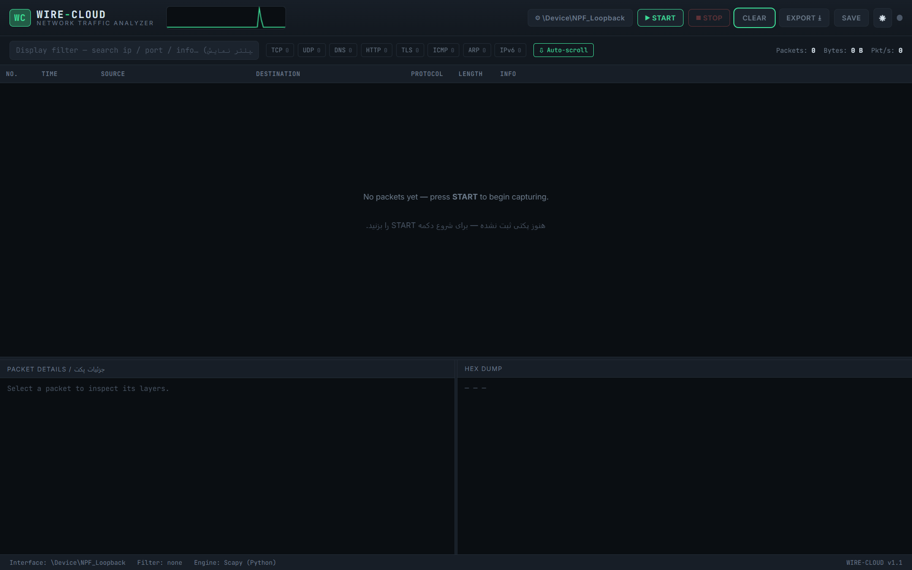

<h1 align="center">👁️ WIRE-CLOUD 👁️</h1>
<p align="center">
  <i>A Wireshark-style, web-based network traffic analyzer — runs locally on Windows & Linux. </i>
</p>
<p align="center">
  


### 📃 Overview :
```text
WIRE-CLOUD is a local, self-hosted packet capture and analysis tool with a dark, professional web dashboard. 
It shows live traffic in a sortable packet list, 
a per-packet protocol layer tree, and a hex/ASCII dump — the same mental model as Wireshark, 
but reachable from any browser on `http://127.0.0.1:5000` with no desktop GUI framework required.
```
```text
این یک ابزار ضبط و تحلیل پکت است که به صورت لوکال روی سیستم شما اجرا می شود
 و یک داشبورد وب تیره و حرفه ای دارد. ترافیک زنده را در یک جدول مرتب‌سازی نمایش می‌دهد
 دقیقاً همان مدل وایرشارک اما از طریق هر مرورگری روی آدرس
 http://127.0.0.1:5000
 قابل دسترسی است، بدون نیاز به فریم‌ورک گرافیکی دسکتاپ.
```


##

### ⚡ Features :
```text
  - Startup capture setup** — a modal asks you to pick the interface and an optional BPF filter (with quick presets: TCP/UDP/Web/DNS/ICMP) right when the app opens, before anything else happens
  - **Light / dark theme toggle** (☀ / ☾ button in the header), remembered between visits
  - Live packet capture over any local interface, with BPF filter syntax (`tcp port 443`, `udp`, `host 8.8.8.8`, …)
  - Real-time packet list pushed over WebSocket, batched every ~120 ms for smooth scrolling even at high packet rates
  - Protocol-coded rows (TCP / UDP / DNS / HTTP / TLS / ICMP / ARP / IPv6) with quick filter chips that show a live per-protocol count
  - New packets briefly flash so you can track live traffic without losing your place
  - **Auto-scroll toggle** — pause auto-scroll to inspect packets without the list jumping around
  - Click any packet → full layer-by-layer detail tree + hex/ASCII dump, resizable panes
  - Live "pulse" throughput graph in the header
  - Display filter box (search by IP, port, or info text) — client-side, instant
  - Export the current capture buffer to a standard `.pcap` file (openable in real Wireshark)
  - "Save session" → persists a `.pcap` + JSON summary that the PHP dashboard can list and let you re-download
  - Optional C++ helper for lower-overhead raw capture (`cpp/raw_capture.cpp`)
```


##

### 🔎 Project structure :

```
wire-cloud/
├── backend/
│   ├── app.py                # Flask + Socket.IO server (REST + WebSocket API)
│   ├── capture_engine.py     # Scapy-based cross-platform sniffer
│   └── requirements.txt
├── frontend/
│   ├── templates/index.html  # Main dashboard page
│   └── static/
│       ├── css/style.css     # Dark professional theme
│       └── js/app.js         # Live table, filters, hex view, splitters
├── php/
│   ├── index.php             # Session-history reporting dashboard
│   ├── download.php          # Safe .pcap download endpoint
│   └── report.css
├── cpp/
│   ├── raw_capture.cpp       # Optional high-performance libpcap sniffer
│   └── Makefile
├── captures/                 # Saved sessions land here (.pcap + .json)
├── run_linux.sh              # One-command launcher for Linux
├── run_windows.bat           # One-command launcher for Windows
└── README.md
```


##

### ⚙️ Tech stack :

| Layer / لایه | Technology / فناوری | Role / نقش |
|---|---|---|
| Capture engine / موتور ضبط | **Python** + Scapy | Cross-platform live sniffing, protocol parsing, pcap export |
| Web backend / بک‌اند وب | **Python** (Flask + Flask-SocketIO) | REST API + real-time WebSocket packet stream |
| Web frontend / فرانت‌اند وب | **HTML5 / CSS3 / JavaScript** | Wireshark-like dashboard, live oscilloscope, hex viewer |
| Reporting module / ماژول گزارش‌گیری | **PHP** | Read-only dashboard listing saved capture sessions (`php/`) |
| High-performance capture (optional) / ضبط پرسرعت (اختیاری) | **C++** + libpcap | Standalone raw-socket sniffer emitting JSON lines (`cpp/`) |


##

### 🌐 Requirements :

- Python 3.9+
- **Linux:** `libpcap` (usually pre-installed; if not: `sudo apt install libpcap-dev`) and root privileges to capture.
- **Windows:** [Npcap](https://npcap.com) installed with **"Install Npcap in WinPcap API-compatible Mode"** checked, and Administrator privileges to capture.
- (Optional) PHP 8+ if you want to run the reporting dashboard.
- (Optional) `g++` and libpcap headers if you want to build the C++ helper.

##

### 💡 Installation & run — Linux :
### Automatic :
```bash
git clone https://github.com/The-Lxx-CLoUD/WIRE-CLoUD
```
```bash
cd WIRE-CLoUD
```
```bash
chmod +x run_linux.sh
```
```bash
sudo ./run_linux.sh
```
### Manually :
```text 
1 - python3 -m venv venv
2 - source venv/bin/activate
3 - pip install -r backend/requirements.txt
4 - sudo venv/bin/python backend/app.py
```
##

### 💡 Installation & run — Windows :

### Automatic :
```text
1 - open WIRE-CLoUD folder.
2 - Right-click `run_windows.bat` → Run as administrator.
3 - Your browser opens automatically at **http://127.0.0.1:5000**.
```
### Manually :
```text
1 - Install Python 3.9+👉(https://python.org)👈 and make sure "Add Python to PATH" is checked during setup.
2 - Install Npcap👉(https://npcap.com)👈 — during setup, check "Install Npcap in WinPcap API-compatible Mode".
3 - Right-click `run_windows.bat` → Run as administrator.
    The script creates a virtual environment, installs dependencies, and launches the server.
4 - Your browser opens automatically at **http://127.0.0.1:5000**.
```
##

### 🔰 Using the dashboard :

1. On first load, a **setup modal** appears — pick a network interface and, optionally, a BPF filter (or use a preset chip like "Web (80/443)" or "DNS"). Click **Start capturing** to jump straight into a live capture, or **Decide later** to just save the choice without starting yet.
2. Packets stream into the table live. Click **STOP** to pause, or the **⚙ settings** button in the header to reopen the setup modal and change interface/filter (capture must be stopped first).
3. Click any row to see its full protocol layer tree and hex/ASCII dump below.
4. Use the **display filter** box or protocol chips (each shows a live count) to narrow what's shown — this only affects the view, not what's captured.
5. Toggle **Auto-scroll** off if you want to inspect older packets without the list jumping to the newest one.
6. Use the **☀ / ☾** button in the header to switch between light and dark themes — your choice is remembered.
7. Use **EXPORT** to download a `.pcap` you can open in real Wireshark, or **SAVE** to archive the session with a JSON summary for the PHP reports dashboard.
8. Use **CLEAR** to empty the in-memory buffer.

##

### ⚠️ PHP reporting dashboard (optional) :

Sessions saved from the main app (`SAVE SESSION` button) land in `captures/`. To browse them:
```bash
php -S 127.0.0.1:8080 -t php
```
Open **http://127.0.0.1:8080**. This dashboard is read-only and does not itself capture traffic — it only lists and lets you re-download previously saved `.pcap` sessions and their protocol breakdown.

##

### 🔥 Optional C++ high-performance capture module :

For advanced users who want a lower-overhead capture process outside Python, `cpp/raw_capture.cpp` is a standalone libpcap sniffer that prints one JSON object per packet to stdout. It is **not required** — the default Python/Scapy engine is sufficient for normal use.
```bash
cd cpp
```
```bash
make               
```
```bash
sudo ./raw_capture eth0 "tcp or udp"
```


##

### 🖥️ Troubleshooting :

| Problem / مشکل | Fix / راه‌حل |
|---|---|
| **EN** "Permission denied" when starting capture | Run with `sudo` (Linux) or as Administrator (Windows). |
| **FA** خطای "Permission denied" هنگام شروع ضبط | برنامه را با `sudo` (لینوکس) یا با دسترسی Administrator (ویندوز) اجرا کنید. |
| **EN** No interfaces listed | Linux: check `ip link`; Windows: confirm Npcap is installed correctly. |
| **FA** هیچ کارت شبکه‌ای نمایش داده نمی‌شود | لینوکس: با `ip link` بررسی کنید؛ ویندوز: از نصب صحیح Npcap مطمئن شوید. |
| **EN** Port 5000 already in use | Edit the last line of `backend/app.py` and change `port=5000`. |
| **FA** پورت ۵۰۰۰ قبلاً استفاده شده | خط آخر فایل `backend/app.py` را ویرایش کرده و `port=5000` را تغییر دهید. |
| **EN** Browser doesn't auto-open | Manually visit `http://127.0.0.1:5000`. |
| **FA** مرورگر به‌صورت خودکار باز نمی‌شود | به‌صورت دستی آدرس `http://127.0.0.1:5000` را باز کنید. |

##

### 👤 Author :

- GitHub : [@TheLxxCLoUD](https://github.com/The-Lxx-CLoUD)
- Telegram : [@lxxcloud](https://t.me/lxxcloud)


```text
For personal, educational, and authorized security-testing use. Use responsibly and only on networks you are permitted to monitor.
```

```text
For educational and authorized security testing purposes only.
Use this tool only on systems you own or have explicit permission to test.
The user bears full responsibility for ensuring lawful use.
 The developer assumes no liability for any misuse or illegal activity associated with this tool.

```


